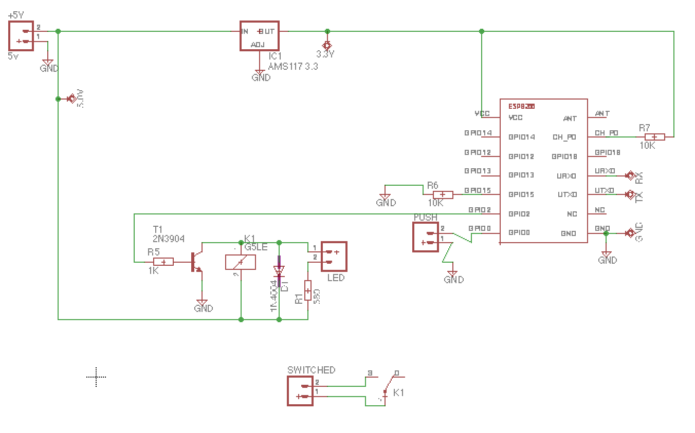
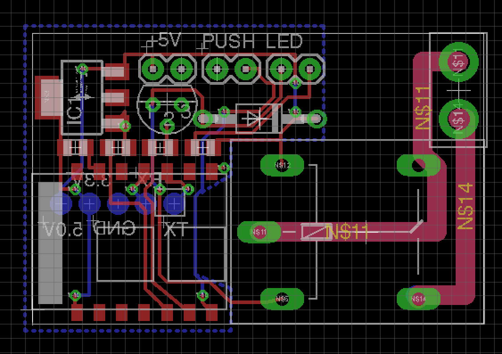

**mqttSwitch2.0**
==========
**Features:**

ESP8266
* Status of GPIO pins as published mqtt-message
* Capability of esp sent on boot to mqtt broker
* Set status of GPIO pin (on-off for now) via MQtt Message (Set at compiletime capabilities)
* WifiManager with Mqtt settings available
* OTA prepared (For boards with more than 4mbit memory)
* Mangled version of [MQTT library for the ESP8266 ](https://github.com/tuanpmt/esp_mqtt) library included. Will now work with Arduino ESP8266 SDK. (after a slight mod to platform.txt)
* Mqtt with SSL enabled only
* Mqtt with username + password

HTML
* Java-script enabled interface to control multiple switches. Uses Getvariables for username/password
* Nice-name for each switch configured here
* No webserver required everything is handled in web-browser

OTA Firmwarecheck
* php required, script included based on the standard examples.

**Installation**
(Instructions for macOS)

* edit: ~/Library/Arduino15/packages/esp8266/hardware/esp8266/2.3.0 platform.txt  add "-lssl --allow-multiple-definition" to the end of the Linker row. (the row begins with compiler.c.elf.libs=)
See http://www.delorie.com/gnu/docs/binutils/ld_3.html for information. The linker uses the first found definition)
* symlink in Mqtt library "ln -s $(pwd)/lib/mqtt ~/Documents/Arduino/libraries/mqtt" or move it there
***Libraries used***
* [MQTT library for the ESP8266 ](https://github.com/tuanpmt/esp_mqtt) By Tuanpmt (thanks!) (This is included in the repo for use by Arduino ESP8266) (MIT-License)
* [WifiManager library for the ESP8266 ](https://github.com/tzapu/WiFiManager#install-through-library-manager) By Tzapu (MIT-License)
* [ArduinoJson library for Arduino](https://github.com/bblanchon/ArduinoJson) (MIT-License)

**Hardware**
(This description is a mess sorry, please see included eagle files)
GPIO2 is connected to the base of a NPN3906 transistor via a 1k resistor. Collector is conneted to Ground, Emittor is connected to the Relay. the Groound of relay to 5.0v (USB)
ESP8266 -03, GPIO 15 via 10k resistor to ground, CH_PD via 10k resistor to VCC 3.3v regulator AMS1117 connected to VCC5.0

***Schematic***

***Board***

**Author:**
[Mikael "Murf" Mellgren](https://murf.se)

**LICENSE - "MIT License"**
mqttSwitch2.0: Copyright (c) 2014-2016 Murf, https://murf.se

Permission is hereby granted, free of charge, to any person obtaining a copy of this software and associated documentation files (the "Software"), to deal in the Software without restriction, including without limitation the rights to use, copy, modify, merge, publish, distribute, sublicense, and/or sell copies of the Software, and to permit persons to whom the Software is furnished to do so, subject to the following conditions:

The above copyright notice and this permission notice shall be included in all copies or substantial portions of the Software.

THE SOFTWARE IS PROVIDED "AS IS", WITHOUT WARRANTY OF ANY KIND, EXPRESS OR IMPLIED, INCLUDING BUT NOT LIMITED TO THE WARRANTIES OF MERCHANTABILITY, FITNESS FOR A PARTICULAR PURPOSE AND NONINFRINGEMENT. IN NO EVENT SHALL THE AUTHORS OR COPYRIGHT HOLDERS BE LIABLE FOR ANY CLAIM, DAMAGES OR OTHER LIABILITY, WHETHER IN AN ACTION OF CONTRACT, TORT OR OTHERWISE, ARISING FROM, OUT OF OR IN CONNECTION WITH THE SOFTWARE OR THE USE OR OTHER DEALINGS IN THE SOFTWARE.
